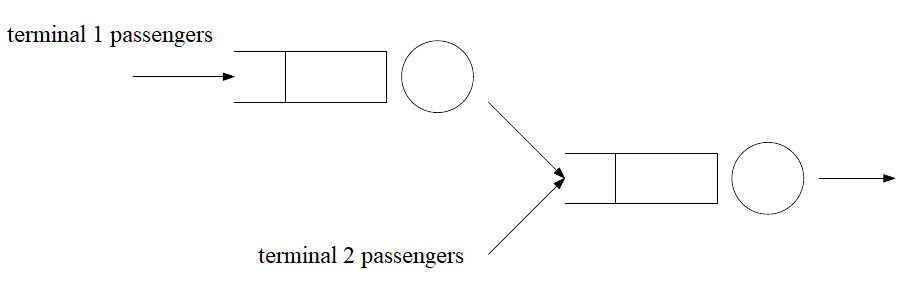

# System_Simulation_Proj2
To simulate airport terminal series and evaluate the performance

A terminal at an airport has one queue to check in for the Terminal $1$ passengers. After the
check-in, passengers join along with Terminal $2$ passengers to a Security-Check
as shown in the following figure.

The arrivals are Poisson distributed with rates $\lambda_1$ and $\lambda_2$ for Terminal $1$ and $2$ passengers, respectively.
The service times are exponentially distributed with service rates $\mu_1, \mu_S$ for terminal $1$ check-in and terminal $2$ security-check, respectively.

The average arrival rates are $10$ customers/hour for Terminal $1$ passengers and $20$ customers/hour for Terminal $2$ passengers.
The average service times at the Terminal $1$ check-in is $2$ minutes per customer. The security check maintains a server utilization of $75\%$ all the time.
